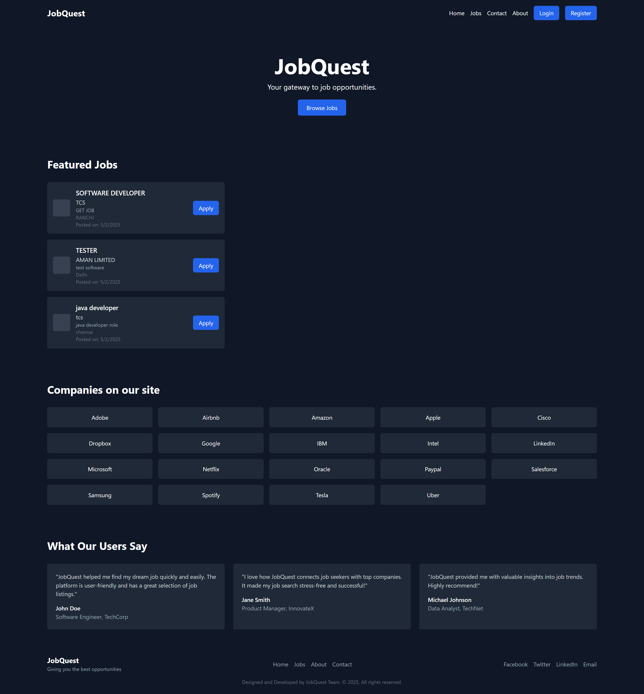
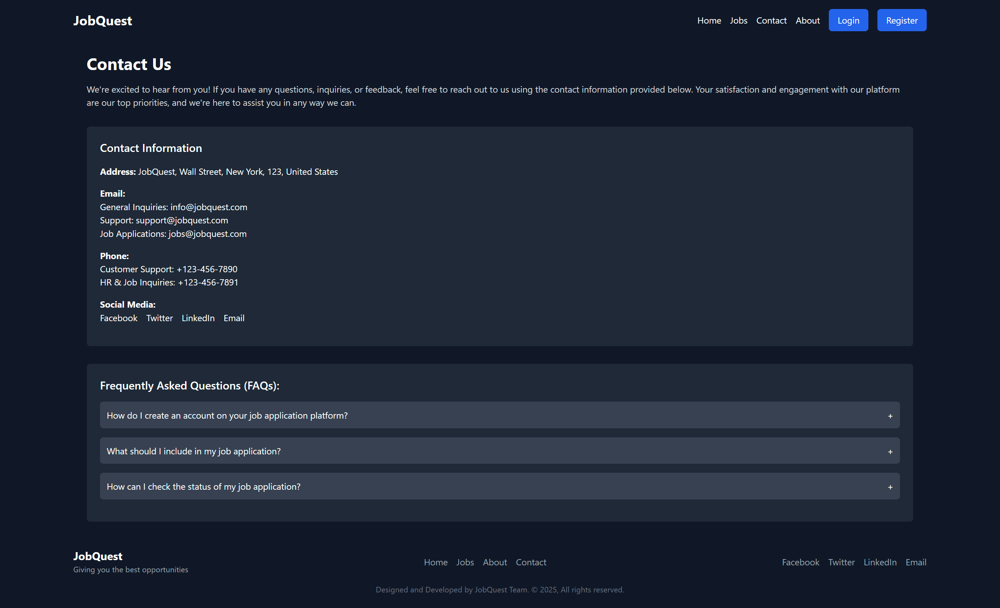
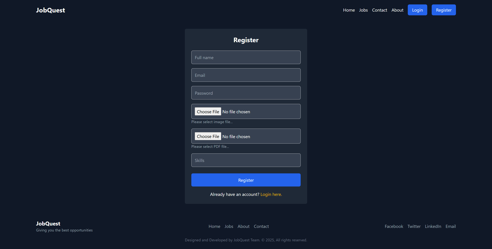
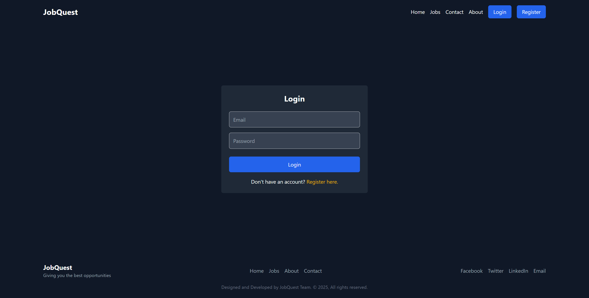

<h1 align="center">
  
</h1>

---

<p align="center">
  
  
  
  
  
</p>

---

<p align="center">
  
</p>

## 📌 Project Overview

**JobQuest** is a futuristic job portal that bridges the gap between job seekers and companies. Built on the powerful **MERN stack**, it ensures blazing speed, scalability, and modern UI.

---


# JobQuest 🔍💼
## 📸 Screenshots

### 🏠 Home Page
<div align="center">

 <p><strong>Home Page</strong> - A clean interface with search and filters.</p>
</div>

---

### 💼 Job Listings
<div align="center">

  <p><strong>Job Listings</strong> - Filter and explore jobs by category.</p>
</div>

---

###  Contact Page
<div align="center">

 <p><strong>Job Listings</strong> - you can contact us.</p>
</div>


### 🔐 Register Page
<div align="center">

 <p><strong>Login Page</strong> - Secure user Register interface.</p>
</div>

### 🔐 Login Page
<div align="center">

  <p><strong>Login Page</strong> - Secure user login interface.</p>
</div>


JobQuest is a full-stack job portal web application where users can post, browse, and apply for jobs. It includes user authentication, job listing management, and a modern UI/UX.

## 🚀 Features

- 🧑‍💼 User Authentication (Login/Signup)
- 📄 Job Posting and Management
- 🔍 Job Browsing by Category, Title, etc.
- ⚙️ Built with MERN Stack (MongoDB, Express, React, Node.js)

## 🛠️ Tech Stack

- **Frontend:** React.js
- **Backend:** Node.js, Express.js
- **Database:** MongoDB
- **Authentication:** JWT
- **Tools:** Git, GitHub, VS Code, Nodemon, dotenv

## 📦 Installation (Development)

```bash
# Clone the repo
git clone https://github.com/AMANPUSHP23/JobQuest.git
cd JobQuest

# Install server dependencies
cd server
npm install

# Install client dependencies
cd ../client
npm install

# Run both client and server (in two terminals)
npm start   # client
npm run dev # server


🤝 Contributing
Pull requests are welcome! For major changes, open an issue to discuss what you’d like to change.

📄 License
MIT

---

### ✅ Step 3: Save and Close the file

---

### ✅ Step 4: Add and Push to GitHub

```bash
git add README.md
git commit -m "Added README.md"
git push
